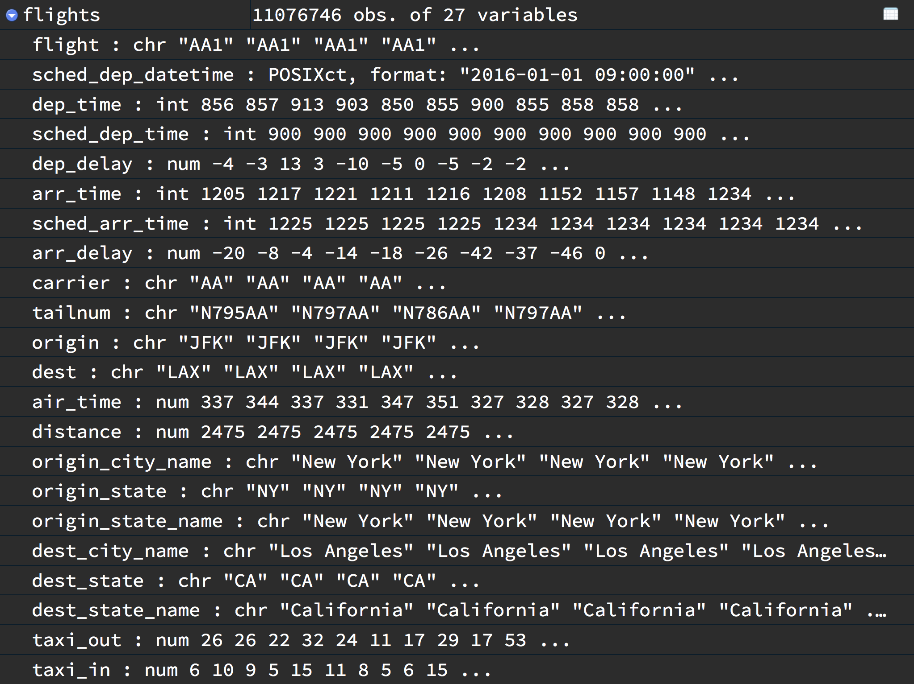
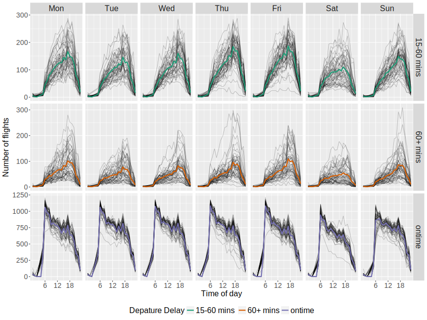

```{r initial, echo = FALSE, cache = FALSE, results = 'hide'}
library(knitr)
options(htmltools.dir.version = FALSE, tibble.width = 60, tibble.print_min = 6)
opts_chunk$set(
  echo = FALSE, warning = FALSE, message = FALSE, comment = "#>",
  fig.path = 'figure/', cache.path = 'cache/', fig.align = 'center', 
  fig.width = 12, fig.height = 11, fig.show = 'hold', 
  cache = TRUE, external = TRUE, dev = 'svglite'
)
read_chunk('src/code.R')
```

```{r load-pkgs}
```

```{r theme-remark}
```

class: middle

## Agenda

* **WIP**: Tidy data structures to support exploration and modeling of temporal-context data
* **Done**: Calendar-based graphics for visualising people’s daily schedules
* **ToDo**: Visualisation of time series with nested and crossed factors

---

background-image: url(figure/map-airlines-1.svg)
background-size: cover

class: bottom center

```{r map-airlines, fig.width = 13, eval = FALSE}
```

# USA airline traffic in 2016 & 2017

*data source: [Bureau of Transportation Statistics](https://www.transtats.bts.gov/DL_SelectFields.asp?Table_ID=236)*

---

background-image: url(img/data-snapshot.png)
background-size: cover

class: inverse bottom center

# Data snapshot

---

.pull-left[
* heterogeneous data types
* multiple measured variables
]
.pull-right[
* fine scale time resolution
* multiple grouping variables
]
.center[]

---

## However ...

The current structure that underlies the time series objects:

\begin{equation}
  \begin{bmatrix}
  X_{11} & X_{21} & \cdots & X_{p1} \\
  X_{12} & X_{22} & \cdots & X_{p2} \\
  \vdots & \vdots & \ddots & \vdots \\
  X_{1T} & X_{2T} & \cdots & X_{pT}
  \end{bmatrix}
\end{equation}

where $X_{jt}$ represents series $j$, for $j = 1, \dots, p$ and $1 \leq t \leq T$, in the form of a $T \times p$ matrix.

--

It requires

* homogeneity (numerical variables)
* time indices implicitly inferred as attributes/meta-information

--

This matrix format is **model-centric**.

---

class: middle

## The matrix structure

.x[
* discards interesting information in the data;
* is more opaque in handling of the temporal components;
* is less efficient for many other data analysis tasks, like forcing the fitting of a square peg into a round hole (削足适履).
]

---

class: middle

## Programmatic workflow

.pull-left[
```{r echo = TRUE, eval = FALSE}
for (...) {
  if (...) {
    ...
  } else {
    ...
  }
  for (...) {
  }
}
...
for (...) {
  if (...) {
    ...
  } else {
    ...
  }
  for (...) {
  }
}
```
]

--

.pull-right[
.shake[]
> Where I'm doing wrong?

> What I'm doing?
]

---

class: middle

## Instead, we'd like

.checked[
* heterogeneous data types to keep the richness of data
* explicitly declared index variable to be easily accessible
* a syntactical approach to express nested or crossed factors
* data pipelines to facilitate the workflow
]

---

class: inverse middle center

.scale-up[]

## Chinglish for time series tibble

---

class: inverse middle center


## ~~Chinglish for time series tibble~~
## The future of time series in R

---

.left-column[
## Tidy temporal data
### - definition
]
.right-column[
.large[Tidy data principles:]
* Each variable forms a column.
* Each observation forms a row.
* Each type of observational unit forms a table.

Make a table
]

---

.left-column[
## Tidy temporal data
### - definition
]
.right-column[
.large[Tidy temporal data:]
* **index**: an explicitly declared variable containing time indices.
* **key**: uniquely identifies each unit that measurements take place on over time.
* **interval**: a common time interval if data with regular time interval.

Make a table
]

---

.left-column[
## Tidy temporal data
### - definition
### - index
]
.right-column[
An explicitly declared variable (e.g. `sched_dep_datetime`) which could contain:
* date/date-time: 
```{r}
seq(ymd_hm("2018-03-14 16:00"), by = "15 mins", length.out = 2)
```
* year-month:
```{r}
yearmonth(seq(2018, by = 1 / 12, length.out = 2))
```
* year-quarter:
```{r}
yearquarter(seq(2018, by = 1 / 4, length.out = 2))
```
* year:
```{r}
seq(2017, by = 1, length.out = 2)
```
* and etc.
]

---

.left-column[
## Tidy temporal data
### - definition
### - index
### - key
]
.right-column[
Uniquely identifies each unit that measurements take place on over time:
* single: 
```{r, echo = TRUE, eval = FALSE}
id(flight)
```
* nested:
```{r, echo = TRUE, eval = FALSE}
id(origin | origin_city | origin_state)
```
* crossed:
```{r, echo = TRUE, eval = FALSE}
id(origin, dest)
```
* nested & crossed
```{r, echo = TRUE, eval = FALSE}
id(origin | origin_state, dest | dest_state)
```
]

---

.left-column[
## Tidy temporal data
### - definition
### - index
### - key
### - tsibble
]
.right-column[

```{r load-data, cache.lazy = FALSE, eval = FALSE}
```

```{r tsibble, cache.lazy = FALSE, eval = FALSE}
```

```{r echo = TRUE, eval = FALSE}
flights %>% 
  as_tsibble(key = id(flight), 
    index = sched_dep_datetime, regular = FALSE)
```

```
*#> # A tsibble: 11,076,746 x 27 [!]
*#> # Keys:      flight [24,647]
#>    flight sched_dep_datetime  dep_time sched_dep_time
#>    <chr>  <dttm>                 <int>          <int>
#>  1 AA1    2016-01-01 09:00:00      856            900
#>  2 AA1    2016-01-02 09:00:00      857            900
#>  3 AA1    2016-01-03 09:00:00      913            900
#>  4 AA1    2016-01-04 09:00:00      903            900
#>  5 AA1    2016-01-05 09:00:00      850            900
#>  6 AA1    2016-01-06 09:00:00      855            900
#> # ... with 11,076,740 more rows, and 23 more variables:
#> #   dep_delay <dbl>, arr_time <int>, sched_arr_time <int>,
#> #   arr_delay <dbl>, carrier <chr>, tailnum <chr>,
#> #   origin <chr>, dest <chr>, air_time <dbl>,
#> #   distance <dbl>, origin_city_name <chr>,
#> #   origin_state <chr>, origin_state_name <chr>,
#> #   dest_city_name <chr>, dest_state <chr>,
#> #   dest_state_name <chr>, taxi_out <dbl>, taxi_in <dbl>,
#> #   carrier_delay <dbl>, weather_delay <dbl>,
#> #   nas_delay <dbl>, security_delay <dbl>,
#> #   late_aircraft_delay <dbl>
```

]

---

.left-column[
## Tidy temporal data
### - definition
### - index
### - key
### - tsibble
]
.right-column[
.center[.large[I. flexible]]

Make a chart
]

---

.left-column[
## Tidy temporal data
### - definition
### - index
### - key
### - tsibble
]
.right-column[
.center[.large[II. mapping from data semantics to its physical layout]]
]

---

.left-column[
## Tidy temporal data
### - definition
### - index
### - key
### - tsibble
]
.right-column[
.center[.large[III. WYTIWYC]]

`r emo::ji("one")` select variables `flight`, `sched_dep_datetime`, `dep_delay`

```{r select, echo = TRUE, cache.lazy = FALSE, eval = FALSE}
```

```
#> # A tsibble: 11,076,746 x 3 [!]
#> # Keys:      flight [24,647]
#>   flight sched_dep_datetime  dep_delay
#>   <chr>  <dttm>                  <dbl>
#> 1 AA1    2016-01-01 09:00:00       -4.
#> 2 AA1    2016-01-02 09:00:00       -3.
#> 3 AA1    2016-01-03 09:00:00       13.
#> 4 AA1    2016-01-04 09:00:00        3.
#> 5 AA1    2016-01-05 09:00:00      -10.
#> 6 AA1    2016-01-06 09:00:00       -5.
#> # ... with 1.108e+07 more rows
```

]

---

.left-column[
## Tidy temporal data
### - definition
### - index
### - key
### - tsibble
]
.right-column[
.center[.large[III. WYTIWYC]]

`r emo::ji("two")` filter observations for 2017

```{r filter, echo = TRUE, cache.lazy = FALSE, eval = FALSE}
```

```
#> # A tsibble: 5,560,846 x 3 [!]
#> # Keys:      flight [22,563]
#>   flight sched_dep_datetime  dep_delay
#>   <chr>  <dttm>                  <dbl>
#> 1 AA1    2017-01-01 08:00:00       31.
#> 2 AA1    2017-01-02 08:00:00       -3.
#> 3 AA1    2017-01-03 08:00:00       -6.
#> 4 AA1    2017-01-04 08:00:00       -3.
#> 5 AA1    2017-01-05 08:00:00       -7.
#> 6 AA1    2017-01-06 08:00:00       -3.
#> # ... with 5.561e+06 more rows
```

]

---

.left-column[
## Tidy temporal data
### - definition
### - index
### - key
### - tsibble
]
.right-column[
.center[.large[III. WYTIWYC]]

`r emo::ji("three")` aggregate to monthly averages

```{r tsum, echo = TRUE, cache.lazy = FALSE, eval = FALSE}
```

```
#> # A tsibble: 12 x 2 [1MONTH]
#>       yrmth avg_delay
#>       <mth>     <dbl>
#>  1 2017 Jan     12.1 
#>  2 2017 Feb      7.10
#>  3 2017 Mar      9.28
#>  4 2017 Apr     12.1 
#>  5 2017 May     10.8 
#>  6 2017 Jun     13.6 
#>  7 2017 Jul     13.1 
#>  8 2017 Aug     11.1 
#>  9 2017 Sep      5.25
#> 10 2017 Oct      6.64
#> 11 2017 Nov      4.26
#> 12 2017 Dec      9.89
```


]

---

.left-column[
## Tidy temporal data
### - definition
### - index
### - key
### - tsibble
]
.right-column[
.center[.large[IV. verbs]]

A consistent set of verbs to solve a wide range of data transformation problems:

* row-wise: `filter()`, `slice()`, `arrange()`, `fill_na()`
* column-wise: `mutate()`, `select()`, `summarise()`, `tsummarise()`

These all naturally work with `group_by()`.

* rolling window: `slide()`, `tile()`, `stretch()`
]

---

class: inverse middle center

## Data pipelines
### break up a big problem into manageable pieces

---

## Question

Have time of the day and day of the week an effect on the on-time performance?

--

```{r delayed-facet, fig.height = 9}
```

---

```{r n-flights-2017, echo = TRUE, cache.lazy = FALSE, eval = FALSE}
```

```
#> # A tsibble: 22,855 x 6 [1HOUR]
#> # Keys:      dep_delay_break [3]
#>   dep_delay_break sched_dep_datetime  n_flight  hour date       wday 
#>   <chr>           <dttm>                 <int> <int> <date>     <ord>
#> 1 15-60 mins      2017-01-01 00:00:00        3     0 2017-01-01 Sun  
#> 2 15-60 mins      2017-01-01 01:00:00        1     1 2017-01-01 Sun  
#> 3 15-60 mins      2017-01-01 02:00:00        2     2 2017-01-01 Sun  
#> 4 15-60 mins      2017-01-01 05:00:00       14     5 2017-01-01 Sun  
#> 5 15-60 mins      2017-01-01 06:00:00       49     6 2017-01-01 Sun  
#> 6 15-60 mins      2017-01-01 07:00:00       68     7 2017-01-01 Sun  
#> # ... with 2.285e+04 more rows
```

---

## Pipeline

.block[
.flowchart[
* `filter()` <br> subset time window
]
]

```{r, echo = TRUE, eval = FALSE}
n_flights <- flights %>% 
* filter(year(sched_dep_datetime) == 2017) %>% 
  mutate(dep_delay_break = case_when(
    dep_delay <= 15 ~ "ontime",
    dep_delay <= 60 ~ "15-60 mins",
    TRUE ~ "60+ mins"
  )) %>% 
  group_by(dep_delay_break) %>% 
  tsummarise(
    floor_date(sched_dep_datetime, unit = "hour"), 
    n_flight = n()
  ) %>% 
  mutate(
    hour = hour(sched_dep_datetime),
    date = as_date(sched_dep_datetime),
    wday = wday(sched_dep_datetime, label = TRUE, week_start = 1)
  )
```

---

## Pipeline

.block[
.flowchart[
* `filter()` <br> subset time window
* `mutate()` <br> create a new variable
]
]

```{r, echo = TRUE, eval = FALSE}
n_flights <- flights %>% 
  filter(year(sched_dep_datetime) == 2017) %>% 
* mutate(dep_delay_break = case_when(
*   dep_delay <= 15 ~ "ontime",
*   dep_delay <= 60 ~ "15-60 mins",
*   TRUE ~ "60+ mins"
* )) %>% 
  group_by(dep_delay_break) %>% 
  tsummarise(
    floor_date(sched_dep_datetime, unit = "hour"), 
    n_flight = n()
  ) %>% 
  mutate(
    hour = hour(sched_dep_datetime),
    date = as_date(sched_dep_datetime),
    wday = wday(sched_dep_datetime, label = TRUE, week_start = 1)
  )
```

---

## Pipeline

.block[
.flowchart[
* `filter()` <br> subset time window
* `mutate()` <br> create a new variable
* `tsummarise()` <br> aggregate to hourly intervals
]
]

```{r, echo = TRUE, eval = FALSE}
n_flights <- flights %>% 
  filter(year(sched_dep_datetime) == 2017) %>% 
  mutate(dep_delay_break = case_when(
    dep_delay <= 15 ~ "ontime",
    dep_delay <= 60 ~ "15-60 mins",
    TRUE ~ "60+ mins"
  )) %>% 
* group_by(dep_delay_break) %>% 
* tsummarise(
*   floor_date(sched_dep_datetime, unit = "hour"), 
*   n_flight = n()
* ) %>% 
  mutate(
    hour = hour(sched_dep_datetime),
    date = as_date(sched_dep_datetime),
    wday = wday(sched_dep_datetime, label = TRUE, week_start = 1)
  )
```

---

## Pipeline

.block[
.flowchart[
* `filter()` <br> subset time window
* `mutate()` <br> create a new variable
* `tsummarise()` <br> aggregate to hourly intervals
* `mutate()` <br> augment time units
]
]

```{r, echo = TRUE, eval = FALSE}
n_flights <- flights %>% 
  filter(year(sched_dep_datetime) == 2017) %>% 
  mutate(dep_delay_break = case_when(
    dep_delay <= 15 ~ "ontime",
    dep_delay <= 60 ~ "15-60 mins",
    TRUE ~ "60+ mins"
  )) %>% 
  group_by(dep_delay_break) %>% 
  tsummarise(
    floor_date(sched_dep_datetime, unit = "hour"), 
    n_flight = n()
  ) %>% 
* mutate(
*   hour = hour(sched_dep_datetime),
*   date = as_date(sched_dep_datetime),
*   wday = wday(sched_dep_datetime, label = TRUE, week_start = 1)
* )
```

---

## Visualise using the grammar of graphics

```{r echo = TRUE, eval = FALSE}
ggplot(n_flights) +
  geom_line(aes(x = hour, y = n_flight, group = date), alpha = 0.25) +
  geom_line(
    aes(x = hour, y = avg_n_flight, colour = dep_delay_break), 
    data = avg_n_flights,
  ) +
  facet_grid(dep_delay_break ~ wday, scales = "free_y")
```

.center[]


---

.left-column[
## Timeline
### - Done
]
.right-column[
.timeline.timeline-left.timeline-with-arrows[
.timeline-block[
.arrow-right[
.timeline-content[
[**Tidy data and statistical visualisation to support exploration of temporal data with R**](http://slides.earo.me/medascin17/) <br>
Workshop @ Data Science Week, Melbourne
.timeline-date[
2017/05
]]]]
.timeline-block[
.arrow-right[
.timeline-content[
[**Sketch people’s daily schedules**](http://slides.earo.me/wombat17/) <br>
Lightning @ Wombat, Melbourne
.timeline-date[
2017/05
]]]]

.timeline-block[
.arrow-right[
.timeline-content[
sugrrants v0.1.0 CRAN release
.timeline-date[
2017/07
]]]]

.timeline-block[
.arrow-right[
.timeline-content[
[**Calendar-based graphics for visualizing people’s daily schedules**](http://pub.earo.me/calendar-vis.pdf) submitted to JSS
.timeline-date[
2017/08
]]]]

.timeline-block[
.arrow-right[
.timeline-content[
[**Analysing sub-daily time series data**](http://slides.earo.me/meetup17/) <br>
Invited talk @ MelbURN, Melbourne
.timeline-date[
2017/10
]]]]
]
]

---

.left-column[
## Timeline
### - Done
]
.right-column[
.timeline.timeline-left.timeline-with-arrows[
.timeline-block[
.arrow-right[
.timeline-content[
[**Calendar-based graphics for visualizing people’s daily schedules**](http://slides.earo.me/iasc17/) <br>
Contributed talk @ IASC, Auckland
.timeline-date[
2017/12
]]]]

.timeline-block[
.arrow-right[
.timeline-content[
tsibble v0.1.0 CRAN release
.timeline-date[
2018/01
]]]]
.timeline-block[
.arrow-right[
.timeline-content[
**Calendar-based graphics for visualizing people’s daily schedules**
won the 2018 ASA Statistical Graphics Student Paper Award
.timeline-date[
2018/01
]]]]

.timeline-block[
.arrow-right[
.timeline-content[
[**When time series meets tibble, it’s tsibble!**](http://slides.earo.me/rstudioconf18/tsibble.pdf)
Poster @ rstudio::conf, San Diego
.timeline-date[
2018/01
]]]]
]
]

---

.left-column[
## Timeline
### - Done
### - ToDo
]
.right-column[
.timeline.timeline-left.purple-flirt.timeline-with-arrows[
.timeline-block[
.arrow-right[
.timeline-content[
Academic visit @ Paris & Brussels
.timeline-date[
2018/04
]]]]
.timeline-block[
.arrow-right[
.timeline-content[
**Tidy data structures to support exploration and modeling of temporal-context data**
submitted JCGS
.timeline-date[
2018/07
]]]]

.timeline-block[
.arrow-right[
.timeline-content[
**Tidy data structures to support exploration and modeling of temporal-context data** <br>
Contributed talk @ UseR!2018, Brisbane
.timeline-date[
2018/07
]]]]

.timeline-block[
.arrow-right[
.timeline-content[
**Calendar-based graphics for visualizing people’s daily schedules** <br>
Contributed talk @ JSM, Vancouver
.timeline-date[
2018/08
]]]]
]
]

---


.left-column[
## Timeline
### - Done
### - ToDo
]
.right-column[
.timeline.timeline-left.purple-flirt.timeline-with-arrows[
.timeline-block[
.arrow-right[
.timeline-content[
**Tidy data structures to support exploration and modeling of temporal-context data** <br>
Contributed talk @ ISCB, Melbourne
.timeline-date[
2018/08
]]]]

.timeline-block[
.arrow-right[
.timeline-content[
**Visualisation of time series with nested and crossed factors**
.timeline-date[
2019/03
]]]]

.timeline-block[
.arrow-right[
.timeline-content[
Thesis `r emo::ji("v")`
.timeline-date[
2019/06
]]]]
]
]

---

class: inverse middle center

## Joint work with Di & Rob


---

class: inverse middle center

### made with [`r icon::fa("heart")`]() and .orange[`r icon::fa("coffee")`]
### xaringan `r emo::ji("crossed_swords")` slides <http://slides.earo.me/phd18>
### reproducible & open source <https://github.com/earowang/phd18>
### This work is under licensed [CC BY-NC 4.0](https://creativecommons.org/licenses/by-nc/4.0/).
